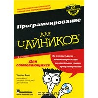
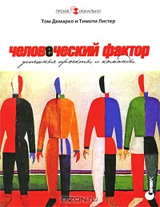
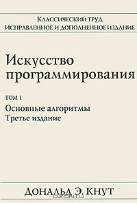

                                                                   
**Матрица компетентности программиста ч.II.**

<table>
  <tr>
   <td><strong> Область </strong>
   </td>
   <td><strong>Уровень</strong>
   </td>
   <td>
   </td>
   <td>
   </td>
   <td>
   </td>
  </tr>
  <tr>
   <td><strong> </strong>
   </td>
   <td><strong>2^n (Уровень 0)</strong>
   </td>
   <td><strong>n^2 (Уровень 1)</strong>
   </td>
   <td><strong>n (Уровень 2)</strong>
   </td>
   <td><strong>log(n) (Уровень 3)</strong>
   </td>
  </tr>
  <tr>
   <td><strong>Програм-</strong>

<strong>мирование</strong>
   </td>
   <td> 
   </td>
   <td> 
   </td>
   <td> 
   </td>
   <td> 
   </td>
  </tr>
  <tr>
   <td><strong>Среда программиро-</strong>

<strong>вания (IDE)</strong>
   </td>
   <td>В основном использует IDE для редактирования текста.
   </td>
   <td>Способен эффективно пользоваться меню в IDE. Знает некоторые тонкости среды.
   </td>
   <td>Для самых используемых функций  среды знает горячие клавиши.
   </td>
   <td>Написал свои макросы.
   </td>
  </tr>
  <tr>
   <td><strong>API</strong>
   </td>
   <td>Часто нуждается в обращениях к документации.
   </td>
   <td>Помнит самые часто используемые API.
   </td>
   <td>Обширные и глубокие знания

API.
   </td>
   <td>Написал библиотеки, которые оборачивают API, для упрощения задач, которые наиболее часто встречаются. Эти библиотеки также часто восполняют пробелы в API.
   </td>
  </tr>
  <tr>
   <td><strong>Фреймфорки</strong>
   </td>
   <td>Не использует никаких фреймверков за рамками основной платформы.
   </td>
   <td>Знает, но не использует популярные фреймворки, доступные для его платформы.
   </td>
   <td>Профессионально пользовался более чем одним фреймворком и хорошо разбирается в идиомах фреймворков. 
   </td>
   <td>Является автором фреймворка.
   </td>
  </tr>
  <tr>
   <td><strong>Требования</strong>
   </td>
   <td>Понимает выставленные требования и пишет код в соответствии со спецификацией.
   </td>
   <td>Задает вопросы касающиеся не рассмотренных в спецификации случаев.
   </td>
   <td>Понимает картину в целом и предлагает дополнительные аспекты, которые должны быть описаны в спецификации.
   </td>
   <td>Может предложить лучшие альтернативы и следовать выставленным требованиям, основываясь на собственном опыте.
   </td>
  </tr>
  <tr>
   <td><strong>Скрипты</strong>
   </td>
   <td>Отсутствует знание скриптовых инструментов.
   </td>
   <td>Batch-файлы/shell.
   </td>
   <td>Perl/Python/Ruby/VBScript/

Powershell.
   </td>
   <td>Писал и публиковал повторно используемые скрипты.
   </td>
  </tr>
  <tr>
   <td><strong>Базы Данных</strong>
   </td>
   <td>Думает, что Excel - это база данных.
   </td>
   <td>Знает основы баз данных, нормализацию, <a href="http://ru.wikipedia.org/wiki/ACID">ACID</a>, транзакции и может написать простые select'ы.
   </td>
   <td>Может спроектировать хорошие нормализованные схемы БД, с учетом запросов, которые будут выполняться; умело использует представления, хранимые процедуры, триггеры и собственные типы данных. Понимает разницу между кластеризованными и не-кластеризованными индексами. Специалист в использовании  <a href="http://ru.wikipedia.org/wiki/ORM">ORM</a> -тулзов.
   </td>
   <td>Может осуществлять администрирование БД, оптимизацию производительности БД, индексную оптимизацию, писать сложные select'ы, может заменить использование курсора  вызовами функций sql, понимает как данные хранятся внутри, как хранятся индексы, имеет представление о том, как зеркалятся и реплицируются БД и т.д.  Понимает как работает <a href="http://en.wikipedia.org/wiki/Two-phase_commit_protocol">двухфазный commit</a>.

 
   </td>
  </tr>
  <tr>
   <td><strong>Опыт</strong>
   </td>
   <td> 
   </td>
   <td> 
   </td>
   <td> 
   </td>
   <td> 
   </td>
  </tr>
  <tr>
   <td><strong>Языки и профессиона-</strong>

<strong>льный опыт</strong>
   </td>
   <td><a href="http://ru.wikipedia.org/wiki/%D0%98%D0%BC%D0%BF%D0%B5%D1%80%D0%B0%D1%82%D0%B8%D0%B2%D0%BD%D1%8B%D0%B9_%D1%8F%D0%B7%D1%8B%D0%BA_%D0%BF%D1%80%D0%BE%D0%B3%D1%80%D0%B0%D0%BC%D0%BC%D0%B8%D1%80%D0%BE%D0%B2%D0%B0%D0%BD%D0%B8%D1%8F">Императивные</a> или <a href="http://ru.wikipedia.org/wiki/%D0%9E%D0%B1%D1%8A%D0%B5%D0%BA%D1%82%D0%BD%D0%BE-%D0%BE%D1%80%D0%B8%D0%B5%D0%BD%D1%82%D0%B8%D1%80%D0%BE%D0%B2%D0%B0%D0%BD%D0%BD%D1%8B%D0%B9_%D1%8F%D0%B7%D1%8B%D0%BA_%D0%BF%D1%80%D0%BE%D0%B3%D1%80%D0%B0%D0%BC%D0%BC%D0%B8%D1%80%D0%BE%D0%B2%D0%B0%D0%BD%D0%B8%D1%8F">объектно-ориентированные</a> программирования
   </td>
   <td><a href="http://ru.wikipedia.org/wiki/%D0%98%D0%BC%D0%BF%D0%B5%D1%80%D0%B0%D1%82%D0%B8%D0%B2%D0%BD%D1%8B%D0%B9_%D1%8F%D0%B7%D1%8B%D0%BA_%D0%BF%D1%80%D0%BE%D0%B3%D1%80%D0%B0%D0%BC%D0%BC%D0%B8%D1%80%D0%BE%D0%B2%D0%B0%D0%BD%D0%B8%D1%8F">Императивные</a>, <a href="http://ru.wikipedia.org/wiki/%D0%9E%D0%B1%D1%8A%D0%B5%D0%BA%D1%82%D0%BD%D0%BE-%D0%BE%D1%80%D0%B8%D0%B5%D0%BD%D1%82%D0%B8%D1%80%D0%BE%D0%B2%D0%B0%D0%BD%D0%BD%D1%8B%D0%B9_%D1%8F%D0%B7%D1%8B%D0%BA_%D0%BF%D1%80%D0%BE%D0%B3%D1%80%D0%B0%D0%BC%D0%BC%D0%B8%D1%80%D0%BE%D0%B2%D0%B0%D0%BD%D0%B8%D1%8F">объектно-ориентиро-</a>

<a href="http://ru.wikipedia.org/wiki/%D0%9E%D0%B1%D1%8A%D0%B5%D0%BA%D1%82%D0%BD%D0%BE-%D0%BE%D1%80%D0%B8%D0%B5%D0%BD%D1%82%D0%B8%D1%80%D0%BE%D0%B2%D0%B0%D0%BD%D0%BD%D1%8B%D0%B9_%D1%8F%D0%B7%D1%8B%D0%BA_%D0%BF%D1%80%D0%BE%D0%B3%D1%80%D0%B0%D0%BC%D0%BC%D0%B8%D1%80%D0%BE%D0%B2%D0%B0%D0%BD%D0%B8%D1%8F">ванные</a> и <a href="http://ru.wikipedia.org/wiki/%D0%94%D0%B5%D0%BA%D0%BB%D0%B0%D1%80%D0%B0%D1%82%D0%B8%D0%B2%D0%BD%D1%8B%D0%B9_%D1%8F%D0%B7%D1%8B%D0%BA_%D0%BF%D1%80%D0%BE%D0%B3%D1%80%D0%B0%D0%BC%D0%BC%D0%B8%D1%80%D0%BE%D0%B2%D0%B0%D0%BD%D0%B8%D1%8F">декларативные</a> (SQL) языки программирования. Дополнительный бонус - если понимает разницу между статической и динамической, слабой и строгой типизацией, 

<a href="http://en.wikipedia.org/wiki/Type_inference">статически выводимыми типами</a>.
   </td>
   <td><a href="http://ru.wikipedia.org/wiki/%D0%AF%D0%B7%D1%8B%D0%BA_%D1%84%D1%83%D0%BD%D0%BA%D1%86%D0%B8%D0%BE%D0%BD%D0%B0%D0%BB%D1%8C%D0%BD%D0%BE%D0%B3%D0%BE_%D0%BF%D1%80%D0%BE%D0%B3%D1%80%D0%B0%D0%BC%D0%BC%D0%B8%D1%80%D0%BE%D0%B2%D0%B0%D0%BD%D0%B8%D1%8F">Функциональные языки программирования</a>. Дополнительный бонус - если знает, что такое <a href="http://ru.wikipedia.org/wiki/%D0%9B%D0%B5%D0%BD%D0%B8%D0%B2%D1%8B%D0%B5_%D0%B2%D1%8B%D1%87%D0%B8%D1%81%D0%BB%D0%B5%D0%BD%D0%B8%D1%8F">"ленивые вычисления"</a>, <a href="http://ru.wikipedia.org/wiki/%D0%9A%D0%B0%D1%80%D1%80%D0%B8%D0%BD%D0%B3">каррирование</a>, <a href="http://en.wikipedia.org/wiki/Continuations">продолжения</a>.
   </td>
   <td><a href="http://en.wikipedia.org/wiki/Concurrent_computing#Concurrent_programming_languages">Конкурентные</a> 

(Erlang, Oz) и <a href="http://ru.wikipedia.org/wiki/%D0%9B%D0%BE%D0%B3%D0%B8%D1%87%D0%B5%D1%81%D0%BA%D0%BE%D0%B5_%D0%BF%D1%80%D0%BE%D0%B3%D1%80%D0%B0%D0%BC%D0%BC%D0%B8%D1%80%D0%BE%D0%B2%D0%B0%D0%BD%D0%B8%D0%B5">логические</a> (Prolog).
   </td>
  </tr>
  <tr>
   <td><strong>Годы профессиональ-</strong>

<strong>ного опыта</strong>
   </td>
   <td>1
   </td>
   <td>2-5
   </td>
   <td>6-9
   </td>
   <td>10+
   </td>
  </tr>
  <tr>
   <td><strong>Годы профессиональ-</strong>

<strong>ного опыта конкретной платформы</strong>
   </td>
   <td>1
   </td>
   <td>2-3
   </td>
   <td>4-5
   </td>
   <td>6+
   </td>
  </tr>
  <tr>
   <td><strong>Знание <a href="http://en.wikipedia.org/wiki/Domain-specific_modeling">предметной области</a></strong>
   </td>
   <td>Не знает о понятии "предметная область".
   </td>
   <td>Работал хотя бы над одним продуктом в своей предметной области.
   </td>
   <td>Работал над несколькими продуктами в одной и той же предметной области.
   </td>
   <td>Эксперт своей предметной области, проектировал и реализовывал несколько продуктов/решений в ней, хорошо разбирается в ее сущностях и протоколах.
   </td>
  </tr>
  <tr>
   <td><strong>Знания</strong>
   </td>
   <td> 
   </td>
   <td> 
   </td>
   <td> 
   </td>
   <td> 
   </td>
  </tr>
  <tr>
   <td><strong>Инструментарии</strong>
   </td>
   <td>Ограничены используемой IDE (<a href="http://ru.wikipedia.org/wiki/Visual_Studio">VS.Net</a>, <a href="http://ru.wikipedia.org/wiki/Eclipse">Eclipse</a> и т.д.)
   </td>
   <td>Знает о некоторых альтернативах популярным стандартным инструментариям.
   </td>
   <td>Хорошие знания редакторов кода, отладчиков, различных IDE, open-source альтернативах и т.д. (Например, это может быть кто-то, кто знает большинство тулзов из <a href="http://www.hanselman.com/blog/ScottHanselmans2007UltimateDeveloperAndPowerUsersToolListForWindows.aspx">списка Скота Ганзельмана</a>.)

Использует <a href="http://wiki.geeklog.net/wiki/index.php/Introduction_to_Object_Relational_Mapping_(ORM)_Tools">ORM-тулзы</a>.
   </td>
   <td>Написал свои инструментарии и скрипты, дополнительный плюс - если эти скрипты были опубликованы.
   </td>
  </tr>
  <tr>
   <td><strong><a href="http://ru.wikipedia.org/wiki/%D0%9E%D1%81%D0%BD%D0%BE%D0%B2%D0%B0%D0%BD%D0%B8%D0%B5_%D0%BA%D0%BE%D0%B4%D0%B0">Code base (кодовая база)</a></strong>
   </td>
   <td>Никогда не смотрел кодовую базу.
   </td>
   <td>Имеет общее представление о расположении кода и о том, как его собрать.
   </td>
   <td>Хорошие рабочие знания кодовой базы, реализовывал несколько багфиксов и, может быть, некоторые маленькие фичи.
   </td>
   <td>Реализовал несколько больших фич в кодовой базе, может легко описать изменения, требуемые для реализации большинства фич или багфисков.
   </td>
  </tr>
  <tr>
   <td><strong>Знание новейших технологий</strong>
   </td>
   <td>Не слышал о новейших технологиях.
   </td>
   <td>Слышал о новейших технологиях в своей области.
   </td>
   <td>Скачивал alpha/preview/CTP

/beta-версии и читал некоторые статьи и руководства на эти темы.
   </td>
   <td>Пробовал сделать что-либо сам. Используя preview-версию сбилдил свою программу. Дополнительный плюс - если сделал свое решение доступным для других.
   </td>
  </tr>
  <tr>
   <td><strong>Знание внутренних аспектов платформы</strong>
   </td>
   <td>Нулевые знания внутренних аспектов платформы.
   </td>
   <td>В основном, знает как работает платформа внутри.
   </td>
   <td>Имеет глубокие познания внутренних аспектов платформы и может обрисовать, как платформа исполняет программный код.
   </td>
   <td>Написал свои тулзы для расширения возможностей платформы или для извлечения дополнительной информации о работе платформы. Например расширения дизассемблера, декомпилятора, отладчика и т.д.
   </td>
  </tr>
  <tr>
<td><strong>Книги</strong>
</td>
<td>

  
Серии книг
  
<a href="http://www.ozon.ru/?context=search&group=div_book&text=%ef%f0%ee%e3%f0%e0%ec%ec%e8%f0%ee%e2%e0%ed%e8%e5+%e4%eb%ff+%f7%e0%e9%ed%e8%ea%ee%e2&partner=omega-it">"... за 21 день"</a>
  
<a href="http://www.ozon.ru/?context=search&group=div_book&text=%ef%f0%ee%e3%f0%e0%ec%ec%e8%f0%ee%e2%e0%ed%e8%e5+%e4%eb%ff+%f7%e0%e9%ed%e8%ea%ee%e2&partner=omega-it">"... за 24 часа"</a>
  
<a href="http://www.ozon.ru/?context=search&group=div_book&text=%ef%f0%ee%e3%f0%e0%ec%ec%e8%f0%ee%e2%e0%ed%e8%e5+%e4%eb%ff+%f7%e0%e9%ed%e8%ea%ee%e2&partner=omega-it">"... для чайников"</a>.
</td>
<td>

  
<a href="http://www.ozon.ru/context/detail/id/5508646/?partner=omega-it">Совершенный код</a>
  
<a href="http://www.ozon.ru/context/detail/id/3795618/?partner=omega-it">Не заставляйте меня думать!</a>
  
<a href="http://www.ozon.ru/context/detail/id/4066500/?partner=omega-it">Регулярные выражения</a>
</td>
<td>

  
<a href="http://www.ozon.ru/context/detail/id/2338486/?partner=omega-it">Человеческий фактор: успешные проекты и команды</a>
  
<a href="http://www.ozon.ru/context/detail/id/20216992/?partner=omega-it">Приемы объектно-ориентиро-ванного проектирования. Паттерны проектирования</a>
  
<a href="http://www.ozon.ru/context/detail/id/19435989/?partner=omega-it">Жемчужины проектирования</a>
  
<a href="http://www.ozon.ru/context/detail/id/6290126/?partner=omega-it">Руководство по разработке алгоритмов</a>
  
<a href="http://www.ozon.ru/context/detail/id/3353337/?partner=omega-it">Программист-прагматик</a>
  
<a href="http://www.ozon.ru/context/detail/id/83760/">Мифический человеко - месяц</a>
</td>
<td>

  
<a href="http://www.ozon.ru/context/detail/id/1335648/?partner=omega-it">Искусство программирования</a>
  
<a href="http://www.ozon.ru/context/detail/id/5322055/?partner=omega-it">Структура и интерпретация компьютерных программ</a>
  
<a href="http://www.google.com/url?q=http%3A%2F%2Fwww.ozon.ru%2Fcontext%2Fdetail%2Fid%2F1829832%2F%3Fpartner%3Domega-it&sa=D&sntz=1&usg=AFQjCNH-gRS0zAu5vomJrL7qpr0HUCpWhw">Concepts Techniques and    Models of Computer Programming</a>
  
<a href="http://www.ozon.ru/context/detail/id/1829471/?partner=omega-it">Database systems , by C. J Date</a>
  
<a href="http://www.amazon.com/Thinking-Forth-Leo-Brodie/dp/0976458705/ref=pd_bbs_sr_1?ie=UTF8&s=books&qid=1216551535&sr=1-1">Thinking Forth</a>
  
<a href="http://www.amazon.com/Little-Schemer-Daniel-P-Friedman/dp/0262560992/ref=pd_bbs_sr_1?ie=UTF8&s=books&qid=1216551749&sr=1-1">Little Schemer</a>
   </td>
  </tr>
  <tr>
   <td><strong>Блоги</strong>
   </td>
   <td>Слышал о блогах, но не уделял им внимания.
   </td>
   <td>Читает технические блоги, блоги о программировании и разработке ПО и регулярно слушает подкасты.
   </td>
   <td>Ведет ссылочный блог, содержащий коллекции  ссылок на полезные статьи и тулзы, которые [ссылки] он собирает.
   </td>
   <td>Ведет блог, в котором содержится его собственные понимание вопросов программирования.
   </td>
  </tr>
</table>

<strong> </strong>

_Замечание 1:_

Каждый следующий уровень включает в себя предыдущий , т.е. разработчик находящийся на уровне 3 должен удовлетворять критериям двух предыдущих уровней.

_Замечание 2:_

Версия документа от 17.05.2013. О дополнениях, ошибках  сообщайте в issues. Спасибо всем, кто помог сделать этот документ лучше!

_Замечание 3:_

Английская версия: [Programmer Competency Matrix](http://www.indiangeek.net/wp-content/uploads/Programmer%20competency%20matrix.htm)

Первая, более теоретическая часть таблицы - **[Матрица компетентности программиста ч.I.>>](README.md)**

